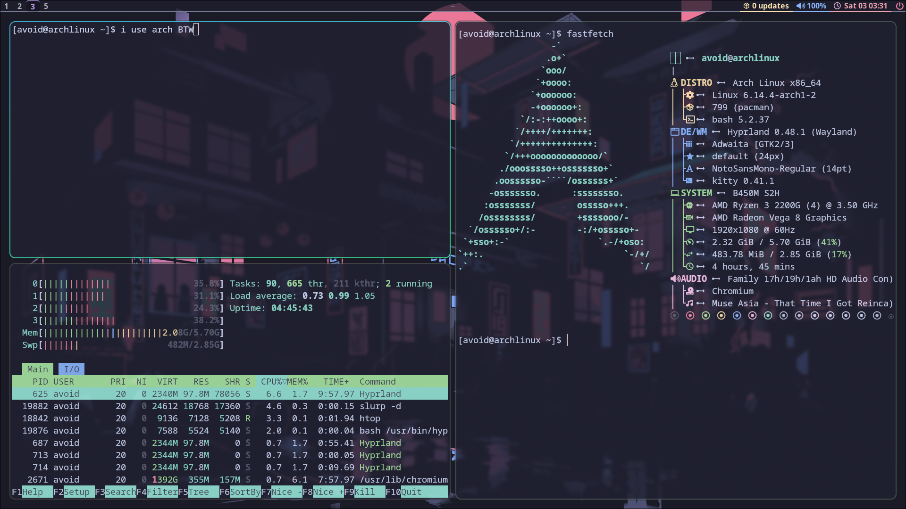
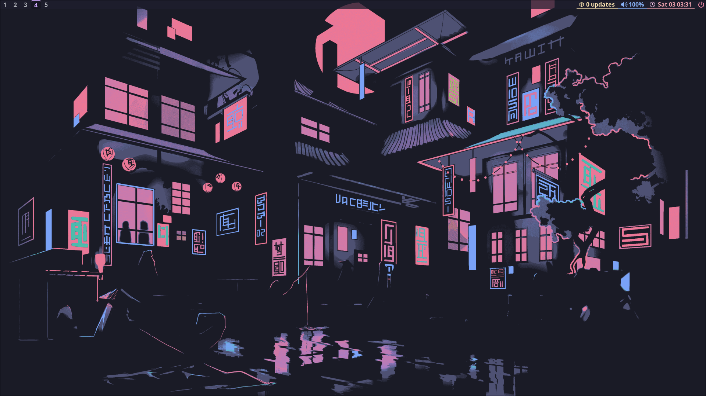

# dotfiles
My personal configuration files for Arch Linux + Hyprland setup. This repo includes configs for terminal, Neovim, Waybar, Hyprland, and more. Version-controlled for portability, backups, and quick setup on new machines.
 

## Screenshots

### Screenshot 1

*Terminal View*

### Screenshot 2

*Desktop View*

---
